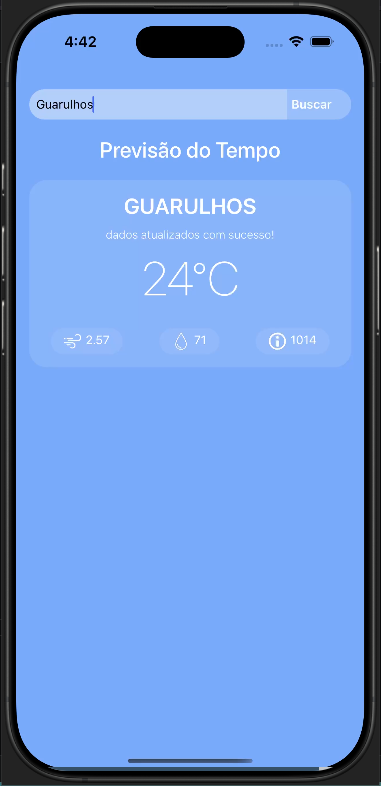

## Aplicativo de Previsão do Tempo  
Este aplicativo permite consultar a previsão do tempo para uma cidade específica utilizando a API OpenWeatherMap. O usuário pode digitar o nome de uma cidade, e o aplicativo exibe a temperatura atual, a velocidade do vento, a pressão atmosférica e a umidade. A interface é simples e intuitiva, e os dados são atualizados automaticamente ao realizar uma busca.

### Funcionalidades:
- Consulta de temperatura, vento, pressão e umidade de uma cidade.
- Exibição de mensagens de atualização de dados.
- Estilização responsiva e agradável com `SafeAreaView` e componentes do React Native.

